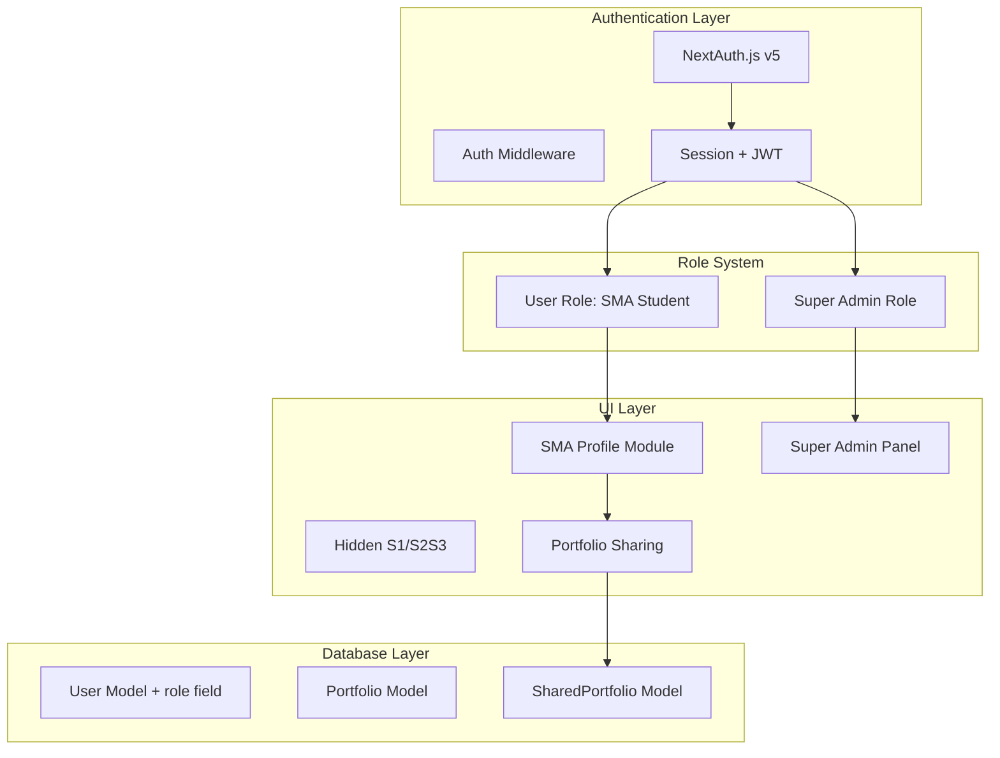

# SMA Priority Refactor Plan

## Overview

Refactor the EduStride system to prioritize High School (SMA) features by temporarily hiding other educational levels and developing a dedicated profile module specifically for SMA students. Additionally, implement a Super Admin role with global privileges to view and manage all user records.

---

## Architecture Overview



---

## Phase 1: Database Schema Updates

### 1.1 Add Role Field to User Model

**File:** `prisma/schema.prisma`

Add `role` field to User model with enum:

```prisma
enum UserRole {
  USER          // Regular SMA student
  ADMIN         // Super Admin
}

model User {
  id            String    @id @default(cuid())
  name          String?
  email         String    @unique
  emailVerified DateTime?
  image         String?
  password      String?
  level         String?   @default("SMA") // Now defaults to SMA
  role          UserRole  @default(USER)  // NEW: Role field
  institution   String?
  bio           String?   @db.Text
  location      String?
  website       String?
  linkedIn      String?
  github        String?
  isProfilePublic Boolean @default(false) // NEW: For profile sharing
  shareToken    String?   @unique         // NEW: Unique token for sharing
  createdAt     DateTime  @default(now())
  updatedAt     DateTime  @updatedAt

  // Relations remain same...
}
```

### 1.2 Create SharedPortfolio Model

**File:** `prisma/schema.prisma`

```prisma
model SharedPortfolio {
  id          String   @id @default(cuid())
  userId      String
  portfolioId String
  shareToken  String   @unique
  isActive    Boolean  @default(true)
  viewCount   Int      @default(0)
  expiresAt   DateTime? // Optional expiration
  createdAt   DateTime @default(now())
  updatedAt   DateTime @updatedAt

  user      User      @relation(fields: [userId], references: [id], onDelete: Cascade)
  portfolio Portfolio @relation(fields: [portfolioId], references: [id], onDelete: Cascade)

  @@index([userId])
  @@index([shareToken])
  @@index([isActive])
}
```

### 1.3 Migration Steps

```bash
npx prisma migrate dev --name add_role_and_sharing
npx prisma generate
```

---

## Phase 2: Hide Non-SMA Levels

### 2.1 Update Level Store

**File:** `lib/store/level-store.ts`

```typescript
// Temporarily limit to SMA only
const AVAILABLE_LEVELS: Level[] = ["SMA"]; // Hide S1, S2/S3

export const useLevelStore = create<LevelState>()(
  persist(
    (set, get) => ({
      currentLevel: "SMA" as Level, // Force SMA as default
      setLevel: (level) => {
        // Only allow SMA level
        if (level === "SMA") {
          set({ currentLevel: level });
        }
      },
      initializeFromSession: (sessionLevel) => {
        // Always default to SMA regardless of session
        set({ currentLevel: "SMA" });
      },
    }),
    {
      name: "edustride-level",
    }
  )
);
```

### 2.2 Update Level Switcher Component

**File:** `components/level-switcher/level-switcher.tsx`

```typescript
// Temporarily hide level switcher or show SMA only
export function LevelSwitcher() {
  const { currentLevel } = useLevelStore();

  // Return simplified version showing only SMA badge
  return (
    <div className="flex items-center gap-2 px-4 py-2 bg-cyan-500/10 rounded-full">
      <span className="w-2 h-2 rounded-full bg-cyan-500" />
      <span className="text-sm font-medium text-cyan-700">SMA Student</span>
    </div>
  );
}
```

### 2.3 Update Dashboard Content for SMA Focus

**File:** `components/dashboard/dashboard-content.tsx`

```typescript
// Force SMA level and hide level-specific widgets temporarily
export function DashboardContent() {
  const { data: session } = useSession();

  // Force SMA context
  const currentLevel: Level = "SMA";

  // Only show CareerExplorerWidget for SMA
  // Hide PortfolioPreviewWidget and ResearchImpactWidget

  return (
    <div className="space-y-6">
      {/* SMA-specific welcome */}
      <SMAWelcomeHeader />

      {/* Career Explorer - Primary widget for SMA */}
      <CareerExplorerWidget />

      {/* Other SMA-specific content */}
    </div>
  );
}
```

---

## Phase 3: Create SMA-Only Profile Module

### 3.1 Create SMA Profile Types

**File:** `types/sma-profile.ts`

```typescript
export interface SMAStudentProfile {
  // Basic Info
  id: string;
  name: string;
  email: string;
  avatar?: string;

  // SMA-Specific Fields
  schoolName: string;
  gradeLevel: "10" | "11" | "12" | "Alumni";
  majorStream?: "IPA" | "IPS" | "Bahasa" | "Other";
  graduationYear: number;

  // Academic Info
  snbtTarget?: string; // Target university
  dreamMajor?: string; // Target major
  academicInterests: string[];

  // Extracurricular
  extracurriculars: ExtracurricularActivity[];
  achievements: SMAAchievement[];

  // Portfolio Sharing
  isProfilePublic: boolean;
  shareToken?: string;
  viewCount: number;
}

export interface ExtracurricularActivity {
  id: string;
  name: string;
  role: string;
  organization: string;
  startDate: Date;
  endDate?: Date;
  description?: string;
}

export interface SMAAchievement {
  id: string;
  title: string;
  category: "Academic" | "Sports" | "Arts" | "Leadership" | "Other";
  level: "School" | "Regional" | "National" | "International";
  year: number;
  description?: string;
  certificateUrl?: string;
}
```

### 3.2 Create SMA Profile API Endpoints

**File:** `app/api/sma/profile/route.ts`

```typescript
import { NextResponse } from "next/server";
import { auth } from "@/auth";
import { prisma } from "@/lib/prisma";
import { z } from "zod";

const updateProfileSchema = z.object({
  schoolName: z.string().min(1),
  gradeLevel: z.enum(["10", "11", "12", "Alumni"]),
  majorStream: z.enum(["IPA", "IPS", "Bahasa", "Other"]).optional(),
  graduationYear: z.number().min(2020).max(2030),
  snbtTarget: z.string().optional(),
  dreamMajor: z.string().optional(),
  academicInterests: z.array(z.string()),
});

// GET - Get SMA profile
export async function GET() {
  const session = await auth();
  if (!session?.user) {
    return NextResponse.json({ error: "Unauthorized" }, { status: 401 });
  }

  const user = await prisma.user.findUnique({
    where: { id: session.user.id },
    include: {
      portfolios: true,
      skills: true,
      achievements: true,
    },
  });

  return NextResponse.json({ profile: user });
}

// PATCH - Update SMA profile
export async function PATCH(request: Request) {
  const session = await auth();
  if (!session?.user) {
    return NextResponse.json({ error: "Unauthorized" }, { status: 401 });
  }

  const body = await request.json();
  const validated = updateProfileSchema.parse(body);

  const user = await prisma.user.update({
    where: { id: session.user.id },
    data: {
      institution: validated.schoolName,
      // Store other fields in JSON or extend schema
    },
  });

  return NextResponse.json({ profile: user });
}
```

### 3.3 Create SMA Profile Page

**File:** `app/[locale]/dashboard/sma-profile/page.tsx`

```typescript
"use client";

import { useSession } from "next-auth/react";
import { useTranslations } from "next-intl";
import { Card, CardContent, CardHeader, CardTitle } from "@/components/ui/card";
import { Button } from "@/components/ui/button";
import { Input } from "@/components/ui/input";
import { Label } from "@/components/ui/label";
import { Select, SelectContent, SelectItem, SelectTrigger, SelectValue } from "@/components/ui/select";
import { SMAProfileShare } from "@/components/sma/sma-profile-share";
import { SMAAchievements } from "@/components/sma/sma-achievements";
import { SMAExtracurriculars } from "@/components/sma/sma-extracurriculars";

export default function SMAProfilePage() {
  const { data: session } = useSession();
  const t = useTranslations("smaProfile");

  return (
    <div className="flex flex-col gap-6">
      {/* Header */}
      <div>
        <h1 className="text-2xl font-bold tracking-tight">{t("title")}</h1>
        <p className="text-muted-foreground">{t("subtitle")}</p>
      </div>

      {/* Profile Sharing Card */}
      <SMAProfileShare />

      {/* Academic Info */}
      <Card>
        <CardHeader>
          <CardTitle>{t("academicInfo")}</CardTitle>
        </CardHeader>
        <CardContent className="space-y-4">
          <div className="grid gap-4 md:grid-cols-2">
            <div className="space-y-2">
              <Label>{t("schoolName")}</Label>
              <Input placeholder="SMA Negeri 1 Jakarta" />
            </div>
            <div className="space-y-2">
              <Label>{t("gradeLevel")}</Label>
              <Select>
                <SelectTrigger>
                  <SelectValue placeholder={t("selectGrade")} />
                </SelectTrigger>
                <SelectContent>
                  <SelectItem value="10">Kelas 10</SelectItem>
                  <SelectItem value="11">Kelas 11</SelectItem>
                  <SelectItem value="12">Kelas 12</SelectItem>
                  <SelectItem value="Alumni">Alumni</SelectItem>
                </SelectContent>
              </Select>
            </div>
            <div className="space-y-2">
              <Label>{t("majorStream")}</Label>
              <Select>
                <SelectTrigger>
                  <SelectValue placeholder={t("selectMajor")} />
                </SelectTrigger>
                <SelectContent>
                  <SelectItem value="IPA">IPA (Science)</SelectItem>
                  <SelectItem value="IPS">IPS (Social)</SelectItem>
                  <SelectItem value="Bahasa">Bahasa (Language)</SelectItem>
                  <SelectItem value="Other">Other</SelectItem>
                </SelectContent>
              </Select>
            </div>
            <div className="space-y-2">
              <Label>{t("graduationYear")}</Label>
              <Input type="number" placeholder="2026" />
            </div>
          </div>

          <div className="grid gap-4 md:grid-cols-2">
            <div className="space-y-2">
              <Label>{t("snbtTarget")}</Label>
              <Input placeholder="Universitas Indonesia" />
            </div>
            <div className="space-y-2">
              <Label>{t("dreamMajor")}</Label>
              <Input placeholder="Teknik Informatika" />
            </div>
          </div>
        </CardContent>
      </Card>

      {/* Achievements */}
      <SMAAchievements />

      {/* Extracurriculars */}
      <SMAExtracurriculars />
    </div>
  );
}
```

---

## Phase 4: Profile Portfolio Sharing

### 4.1 Create Share API

**File:** `app/api/sma/share/route.ts`

```typescript
import { NextResponse } from "next/server";
import { auth } from "@/auth";
import { prisma } from "@/lib/prisma";
import { nanoid } from "nanoid";

// POST - Generate share token
export async function POST(request: Request) {
  const session = await auth();
  if (!session?.user) {
    return NextResponse.json({ error: "Unauthorized" }, { status: 401 });
  }

  const { portfolioIds } = await request.json();

  // Generate unique share token
  const shareToken = nanoid(12);

  // Update user with share token
  await prisma.user.update({
    where: { id: session.user.id },
    data: {
      isProfilePublic: true,
      shareToken,
    },
  });

  // Create shared portfolio entries
  for (const portfolioId of portfolioIds) {
    await prisma.sharedPortfolio.create({
      data: {
        userId: session.user.id,
        portfolioId,
        shareToken,
      },
    });
  }

  const shareUrl = `${process.env.NEXT_PUBLIC_APP_URL}/p/${shareToken}`;

  return NextResponse.json({ shareUrl, shareToken });
}

// DELETE - Revoke share
export async function DELETE() {
  const session = await auth();
  if (!session?.user) {
    return NextResponse.json({ error: "Unauthorized" }, { status: 401 });
  }

  await prisma.user.update({
    where: { id: session.user.id },
    data: {
      isProfilePublic: false,
      shareToken: null,
    },
  });

  await prisma.sharedPortfolio.deleteMany({
    where: { userId: session.user.id },
  });

  return NextResponse.json({ success: true });
}
```

### 4.2 Create Public Profile Page

**File:** `app/[locale]/p/[token]/page.tsx`

```typescript
import { notFound } from "next/navigation";
import { prisma } from "@/lib/prisma";
import { SMAPublicProfile } from "@/components/sma/sma-public-profile";

interface PublicProfilePageProps {
  params: Promise<{ token: string }>;
}

export async function generateMetadata({ params }: PublicProfilePageProps) {
  const { token } = await params;
  const user = await prisma.user.findUnique({
    where: { shareToken: token },
  });

  if (!user || !user.isProfilePublic) {
    return { title: "Profile Not Found" };
  }

  return {
    title: `${user.name} - SMA Student Profile | EduStride`,
    description: `View ${user.name}'s portfolio and achievements`,
  };
}

export default async function PublicProfilePage({ params }: PublicProfilePageProps) {
  const { token } = await params;

  const user = await prisma.user.findUnique({
    where: { shareToken: token },
    include: {
      portfolios: {
        where: { status: "PUBLISHED" },
      },
      skills: true,
      achievements: true,
    },
  });

  if (!user || !user.isProfilePublic) {
    notFound();
  }

  // Increment view count logic here

  return <SMAPublicProfile user={user} />;
}
```

### 4.3 Create Profile Share Component

**File:** `components/sma/sma-profile-share.tsx`

```typescript
"use client";

import { useState } from "react";
import { Card, CardContent, CardHeader, CardTitle } from "@/components/ui/card";
import { Button } from "@/components/ui/button";
import { Switch } from "@/components/ui/switch";
import { Label } from "@/components/ui/label";
import { Input } from "@/components/ui/input";
import { Share2, Copy, Eye, EyeOff } from "lucide-react";
import { toast } from "sonner";
import { useSession } from "next-auth/react";

export function SMAProfileShare() {
  const { data: session } = useSession();
  const [isPublic, setIsPublic] = useState(false);
  const [shareUrl, setShareUrl] = useState("");
  const [isLoading, setIsLoading] = useState(false);

  const handleTogglePublic = async (enabled: boolean) => {
    setIsLoading(true);
    try {
      if (enabled) {
        // Generate share link
        const response = await fetch("/api/sma/share", {
          method: "POST",
          headers: { "Content-Type": "application/json" },
          body: JSON.stringify({ portfolioIds: [] }),
        });
        const data = await response.json();
        setShareUrl(data.shareUrl);
        setIsPublic(true);
        toast.success("Profile sharing enabled!");
      } else {
        // Revoke share
        await fetch("/api/sma/share", { method: "DELETE" });
        setShareUrl("");
        setIsPublic(false);
        toast.success("Profile sharing disabled");
      }
    } catch (error) {
      toast.error("Failed to update sharing settings");
    } finally {
      setIsLoading(false);
    }
  };

  const copyToClipboard = () => {
    navigator.clipboard.writeText(shareUrl);
    toast.success("Link copied to clipboard!");
  };

  return (
    <Card>
      <CardHeader>
        <CardTitle className="flex items-center gap-2">
          <Share2 className="h-5 w-5" />
          Share Your Profile
        </CardTitle>
      </CardHeader>
      <CardContent className="space-y-4">
        <div className="flex items-center justify-between">
          <div className="space-y-0.5">
            <Label>Make Profile Public</Label>
            <p className="text-sm text-muted-foreground">
              Allow others to view your portfolio with a shareable link
            </p>
          </div>
          <Switch
            checked={isPublic}
            onCheckedChange={handleTogglePublic}
            disabled={isLoading}
          />
        </div>

        {isPublic && shareUrl && (
          <div className="space-y-2">
            <Label>Share Link</Label>
            <div className="flex gap-2">
              <Input value={shareUrl} readOnly />
              <Button size="icon" variant="outline" onClick={copyToClipboard}>
                <Copy className="h-4 w-4" />
              </Button>
            </div>
          </div>
        )}
      </CardContent>
    </Card>
  );
}
```

---

## Phase 5: Super Admin Implementation

### 5.1 Update Auth Configuration

**File:** `auth.ts`

```typescript
declare module "next-auth" {
  interface Session {
    user: {
      id: string;
      name?: string | null;
      email?: string | null;
      image?: string | null;
      level?: string | null;
      institution?: string | null;
      role?: "USER" | "ADMIN"; // NEW
    };
  }

  interface User {
    level?: string | null;
    institution?: string | null;
    role?: "USER" | "ADMIN";
  }
}

declare module "next-auth/jwt" {
  interface JWT {
    id?: string;
    level?: string | null;
    institution?: string | null;
    role?: "USER" | "ADMIN";
  }
}

// In authConfig callbacks:
callbacks: {
  async jwt({ token, user }) {
    if (user) {
      token.id = user.id;
      token.level = user.level;
      token.institution = user.institution;
      token.role = user.role; // Include role in JWT
    }
    return token;
  },
  async session({ session, token }) {
    if (token) {
      session.user.id = token.id as string;
      session.user.level = token.level;
      session.user.institution = token.institution;
      session.user.role = token.role; // Include role in session
    }
    return session;
  },
}
```

### 5.2 Create Admin Middleware Helper

**File:** `lib/auth/admin.ts`

```typescript
import { auth } from "@/auth";
import { redirect } from "next/navigation";

export async function requireAdmin() {
  const session = await auth();

  if (!session?.user) {
    redirect("/login");
  }

  if (session.user.role !== "ADMIN") {
    redirect("/dashboard");
  }

  return session;
}

export async function isAdmin(): Promise<boolean> {
  const session = await auth();
  return session?.user?.role === "ADMIN";
}
```

### 5.3 Create Admin Dashboard Layout

**File:** `app/[locale]/admin/layout.tsx`

```typescript
import { requireAdmin } from "@/lib/auth/admin";
import { AdminSidebar } from "@/components/admin/admin-sidebar";

export default async function AdminLayout({
  children,
}: {
  children: React.ReactNode;
}) {
  await requireAdmin();

  return (
    <div className="flex min-h-screen">
      <AdminSidebar />
      <main className="flex-1 p-8">{children}</main>
    </div>
  );
}
```

### 5.4 Create Admin Dashboard Page

**File:** `app/[locale]/admin/page.tsx`

```typescript
import { prisma } from "@/lib/prisma";
import { AdminStatsCards } from "@/components/admin/admin-stats-cards";
import { UsersTable } from "@/components/admin/users-table";

export const metadata = {
  title: "Admin Dashboard - EduStride",
};

export default async function AdminPage() {
  // Get all users with counts
  const [users, totalUsers, smaUsers, portfolioCount] = await Promise.all([
    prisma.user.findMany({
      take: 10,
      orderBy: { createdAt: "desc" },
      include: {
        _count: {
          select: {
            portfolios: true,
            skills: true,
          },
        },
      },
    }),
    prisma.user.count(),
    prisma.user.count({ where: { level: "SMA" } }),
    prisma.portfolio.count(),
  ]);

  return (
    <div className="space-y-8">
      <div>
        <h1 className="text-3xl font-bold">Super Admin Dashboard</h1>
        <p className="text-muted-foreground">
          Manage all users and system settings
        </p>
      </div>

      <AdminStatsCards
        totalUsers={totalUsers}
        smaUsers={smaUsers}
        portfolioCount={portfolioCount}
      />

      <UsersTable users={users} />
    </div>
  );
}
```

### 5.5 Create Admin API Endpoints

**File:** `app/api/admin/users/route.ts`

```typescript
import { NextResponse } from "next/server";
import { requireAdmin } from "@/lib/auth/admin";
import { prisma } from "@/lib/prisma";

export async function GET() {
  await requireAdmin();

  const users = await prisma.user.findMany({
    orderBy: { createdAt: "desc" },
    include: {
      _count: {
        select: {
          portfolios: true,
          skills: true,
          quizAttempts: true,
        },
      },
    },
  });

  return NextResponse.json({ users });
}

export async function DELETE(request: Request) {
  await requireAdmin();

  const { userId } = await request.json();

  await prisma.user.delete({
    where: { id: userId },
  });

  return NextResponse.json({ success: true });
}
```

**File:** `app/api/admin/users/[id]/route.ts`

```typescript
import { NextResponse } from "next/server";
import { requireAdmin } from "@/lib/auth/admin";
import { prisma } from "@/lib/prisma";

export async function GET(
  request: Request,
  { params }: { params: Promise<{ id: string }> }
) {
  await requireAdmin();
  const { id } = await params;

  const user = await prisma.user.findUnique({
    where: { id },
    include: {
      portfolios: true,
      skills: true,
      achievements: true,
      activities: true,
      quizAttempts: {
        include: {
          quiz: true,
        },
      },
    },
  });

  if (!user) {
    return NextResponse.json({ error: "User not found" }, { status: 404 });
  }

  return NextResponse.json({ user });
}
```

---

## Phase 6: Update Navigation

### 6.1 Add Admin Navigation Items

**File:** `lib/data/navigation.ts`

```typescript
export const adminNavItems: NavItem[] = [
  {
    title: "Dashboard",
    titleId: "adminDashboard",
    href: "/admin",
    icon: LayoutDashboard,
  },
  {
    title: "Users",
    titleId: "adminUsers",
    href: "/admin/users",
    icon: Users,
  },
  {
    title: "Portfolios",
    titleId: "adminPortfolios",
    href: "/admin/portfolios",
    icon: FolderOpen,
  },
  {
    title: "Analytics",
    titleId: "adminAnalytics",
    href: "/admin/analytics",
    icon: BarChart3,
  },
  {
    title: "Settings",
    titleId: "adminSettings",
    href: "/admin/settings",
    icon: Settings,
  },
];
```

### 6.2 Update Sidebar for Admin Access

**File:** `components/dashboard/sidebar.tsx`

```typescript
import { isAdmin } from "@/lib/auth/admin";

// Add admin link in sidebar for admin users
{isAdmin && (
  <div className="mt-6 px-4">
    <Link href="/admin">
      <Button variant="outline" className="w-full">
        <Shield className="mr-2 h-4 w-4" />
        Admin Panel
      </Button>
    </Link>
  </div>
)}
```

---

## Phase 7: Create Seed Data for Super Admin

**File:** `app/api/seed/route.ts`

Add to SEED_USERS array:

```typescript
{
  email: "admin@edustride.id",
  name: "Super Admin",
  password: "admin123",
  level: "S1" as const,
  institution: "EduStride Admin",
  bio: "System Administrator",
  image: "https://api.dicebear.com/7.x/avataaars/svg?seed=Admin",
  hasData: false,
  role: "ADMIN" as const, // Add role field
}
```

---

## Phase 8: Update Translations

**File:** `messages/id.json`

```json
{
  "smaProfile": {
    "title": "Profil SMA",
    "subtitle": "Kelola informasi profil dan akademikmu",
    "academicInfo": "Informasi Akademik",
    "schoolName": "Nama Sekolah",
    "gradeLevel": "Tingkat Kelas",
    "selectGrade": "Pilih kelas",
    "majorStream": "Jurusan",
    "selectMajor": "Pilih jurusan",
    "graduationYear": "Tahun Kelulusan",
    "snbtTarget": "Target Universitas (SNBT)",
    "dreamMajor": "Jurusan Impian",
    "shareProfile": "Bagikan Profil",
    "shareDescription": "Bagikan portofoliomu ke teman dan guru"
  }
}
```

**File:** `messages/en.json`

```json
{
  "smaProfile": {
    "title": "High School Profile",
    "subtitle": "Manage your profile and academic information",
    "academicInfo": "Academic Information",
    "schoolName": "School Name",
    "gradeLevel": "Grade Level",
    "selectGrade": "Select grade",
    "majorStream": "Major/Stream",
    "selectMajor": "Select major",
    "graduationYear": "Graduation Year",
    "snbtTarget": "Target University (SNBT)",
    "dreamMajor": "Dream Major",
    "shareProfile": "Share Profile",
    "shareDescription": "Share your portfolio with friends and teachers"
  }
}
```

---

## Testing Checklist

- [ ] Database migration applies successfully
- [ ] Only SMA level is visible/accessible
- [ ] Level switcher is hidden or shows SMA only
- [ ] SMA profile page loads correctly
- [ ] Profile sharing generates unique URLs
- [ ] Public profile pages are accessible without login
- [ ] Admin login works with admin@edustride.id
- [ ] Admin can view all users
- [ ] Admin can view user details
- [ ] Admin sidebar shows admin-only navigation
- [ ] Non-admin users cannot access /admin routes

---

## Rollback Plan

To restore S1 and S2/S3 levels:

1. Revert `lib/store/level-store.ts` changes
2. Revert `components/level-switcher/level-switcher.tsx` changes
3. Update dashboard to show all level widgets
4. Keep admin functionality intact

---

## Security Considerations

1. **Admin Access**: Only users with `role: ADMIN` can access admin routes
2. **Profile Sharing**: Only public profiles are viewable without authentication
3. **Data Isolation**: Admin can view all data but users can only modify their own
4. **Rate Limiting**: Implement rate limiting on public profile endpoints
5. **Share Token**: Use cryptographically secure tokens for profile sharing

---

## User Decisions

| Decision | Choice |
|----------|--------|
| Profile Page | **Replace** existing `/dashboard/profile` with SMA-specific profile |
| Admin Credentials | **admin@edustride.id** / **admin123** |
| Portfolio Sharing | Share **ALL** portfolio items (no selective sharing) |
| Rollback Strategy | **YES** - Feature flag via environment variable |

## Implementation Order

1. **Start with Phase 1** - Database changes (foundation)
2. **Phase 2** - Hide non-SMA levels (UI simplification)
3. **Phase 3 & 4** - SMA profile and sharing (core feature)
4. **Phase 5 & 6** - Admin implementation (admin feature)
5. **Phase 7 & 8** - Navigation and testing (polish)

## Feature Flag Configuration

Add to `.env.local`:
```env
# Feature Flags
NEXT_PUBLIC_SMA_ONLY_MODE=true  # Set to false to restore all levels
```
